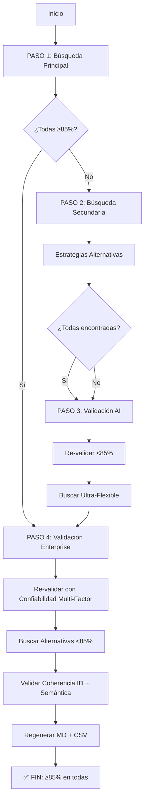

# 🔍 Workflow de Búsqueda de GPCs

## Estrategia de 3 Pases

### 📋 PASO 1: Búsqueda Principal (Alta Calidad)

**Script**: `scripts/find_gpc_links.py --use-smart-validation`

**Estrategia**:
- ✅ **PRIORIDAD CENETEC**: Busca SOLO en CENETEC primero
- ✅ **Validación GPU**: OCR + AI Classification (35% threshold)
- ✅ **Domain Coherence**: NUNCA mezcla CENETEC con IMSS
- ✅ **Incremental Save**: Guarda después de cada GPC
- ✅ **Resume**: Continúa desde donde quedó si se interrumpe
- ✅ **IMSS Fallback**: Solo si CENETEC no tiene nada

**Comando**:
```powershell
$env:GOOGLE_API_KEY = [System.Environment]::GetEnvironmentVariable("GOOGLE_API_KEY", "User")
$env:GOOGLE_CSE_ID = [System.Environment]::GetEnvironmentVariable("GOOGLE_CSE_ID", "User")
python scripts/find_gpc_links.py --use-smart-validation
```

**Tiempo estimado**: 25-35 minutos para 389 GPCs

**Outputs**:
- `data/gpc_links.json` (procesable)
- `data/gpc_links.csv` (Excel)
- `docs/gpc_links_summary.md` (humano)

---

### 🔄 PASO 2: Búsqueda Secundaria (Estrategias Alternativas)

**Script**: `scripts/find_gpc_links_second_pass.py`

**¿Cuándo ejecutar?**
- Después del Paso 1
- Solo para GPCs que NO se encontraron (missing GER/GRR)

**Estrategias alternativas**:

1. **Búsqueda Flexible EN CENETEC PRIMERO** 🔥
   - Título completo en CENETEC
   - Título simplificado en CENETEC
   - Solo términos médicos clave en CENETEC
   - **NUNCA IMSS si hay algo en CENETEC**

2. **Búsqueda en IMSS (solo si CENETEC vacío)**
   - Título completo en IMSS
   - Título simplificado en IMSS
   - Solo términos clave en IMSS

3. **Búsqueda en cualquier .mx (último recurso)**
   - Cualquier dominio `.mx` válido
   - Validación más permisiva (30% threshold)

4. **IMSS Catalog SOLO como ÚLTIMO FALLBACK**
   - Solo si NO se encontró en web (ni CENETEC, ni IMSS, ni .mx)
   - Solo si es reciente (≤5 años por defecto)
   - Extrae año de:
     - Número de GPC (ej: `IMSS-031-08` → 2008)
     - URL (busca `/20XX/`)
   - Si no hay en web y el IMSS es reciente → acepta

**Comando**:
```powershell
$env:GOOGLE_API_KEY = [System.Environment]::GetEnvironmentVariable("GOOGLE_API_KEY", "User")
$env:GOOGLE_CSE_ID = [System.Environment]::GetEnvironmentVariable("GOOGLE_CSE_ID", "User")
python scripts/find_gpc_links_second_pass.py
```

**Opciones**:
- `--max-age 5`: Máxima antigüedad IMSS (años)
- `--sleep 1.0`: Segundos entre búsquedas

**Tiempo estimado**: 10-15 minutos (solo faltantes)

---

### 🔍 PASO 3: Validación AI y Búsqueda Ultra-Flexible

**Script**: `scripts/validate_low_confidence_gpcs.py`

**¿Cuándo ejecutar?**
- Después del Paso 2
- Para GPCs con confianza <85%
- Para GPCs que aún están faltantes

**¿Qué hace?**

**PARTE 1: Re-validación de Baja Confianza**
- Descarga PDFs existentes
- Re-valida con AI + OCR (GPU)
- Si confianza sube a ≥85% → actualiza y mantiene
- Si confianza sigue baja → busca alternativa mejor

**PARTE 2: Búsqueda Ultra-Flexible para Faltantes**
- Estrategias adicionales:
  - Sin `filetype:pdf` (PDFs mal indexados)
  - Solo nombre de enfermedad (sin "diagnóstico", "tratamiento")
  - Búsqueda muy amplia en `.mx`
  - Threshold ultra-permisivo (25%)
- Fallback IMSS catalog (hasta 10 años antigüedad)

**Comando**:
```powershell
$env:GOOGLE_API_KEY = [System.Environment]::GetEnvironmentVariable("GOOGLE_API_KEY", "User")
$env:GOOGLE_CSE_ID = [System.Environment]::GetEnvironmentVariable("GOOGLE_CSE_ID", "User")
python scripts/validate_low_confidence_gpcs.py
```

**Opciones**:
- `--min-confidence 85`: Umbral mínimo (default: 85%)
- `--max-age 10`: Antigüedad máxima IMSS para último recurso
- `--sleep 1.0`: Segundos entre búsquedas

**Tiempo estimado**: 15-25 minutos (depende de cuántos casos problemáticos)

---

### 🏆 PASO 4: VALIDACIÓN ENTERPRISE (Calidad ≥85%)

**Script**: `scripts/super_validator_enterprise.py`

**¿Cuándo ejecutar?**
- Después de cualquier paso anterior
- Para garantizar confiabilidad ≥85% en TODAS las GPCs
- Antes de deployment o revisión final

**¿Qué hace?**

**MEJORAS sobre validadores anteriores**:

1. **Confiabilidad Multi-Factor ENTERPRISE** 🔥
   ```
   confidence = 0.40 * title_similarity +
                0.30 * type_classification +
                0.30 * coherence_ger_grr
   ```
   
   Donde:
   - **40% Title Similarity**: Embedding GPU entre título esperado y extraído (OCR inteligente)
   - **30% Type Classification**: Keywords + longitud (GER vs GRR)
   - **30% Coherence GER-GRR**: Similitud semántica entre contenidos (mismo tema médico)

2. **Re-validación Exhaustiva de Todas las GPCs**
   - Descarga y valida todos los PDFs con fórmula enterprise
   - Actualiza confianzas con métricas multi-factor
   - Detecta casos que quedaron con confianza baja por OCR deficiente

3. **Búsqueda Automática para <85%**
   - Estrategias en cascada:
     1. CENETEC exacto (filetype:pdf)
     2. CENETEC flexible (sin filetype, keywords médicos)
     3. IMSS exacto
     4. IMSS flexible
     5. Cualquier .mx (threshold permisivo 75%)
   - Solo reemplaza si nueva URL tiene **mejor confianza**

4. **Validación de Coherencia ID Semántica**
   - Valida que GER y GRR tengan mismo número GPC
   - **NUEVO**: Valida que hablen del MISMO TEMA médico (embedding ≥70%)
   - Detecta casos como "Hepatitis B con GRR de Hepatitis C"

5. **Regeneración Automática MD + CSV**
   - Actualiza automáticamente todos los archivos de salida
   - Sincroniza JSON → MD → CSV

**FASE 1: Re-Validación Enterprise**
```
[1/389] Diagnóstico de apendicitis aguda
  ✅ GER: 85.0% → 92.3% (título: 94.5%, coherencia: 88.7%)
  ✅ GRR: 85.0% → 91.8% (título: 93.2%, coherencia: 88.7%)
```

**FASE 2: Buscar Alternativas <85%**
```
[5/23] Enfermedad diverticular del colon 2014
  GER actual: 71.6% (buscando alternativa...)
    🔍 Buscando alternativa para GER...
      Validando https://www.cenetec-difusion.com/CMGPC/SS-212-09/ER.pdf...
      ✅ Encontrado! Confianza: 95.2%
  ✅ GER mejorado: 71.6% → 95.2%
```

**FASE 3: Validar Coherencia ID**
```
📊 IDs incoherentes: 12
⚠️  GPCs con IDs diferentes:
  - Síndrome de Ménière: GER=ISSSTE-698-13, GRR=IMSS-613-13
```

**FASE 4: Regenerar Exportaciones**
```
  📝 Generando docs\gpc_links_summary.md...
  ✅ MD generado
  📊 Generando data\gpc_links.csv...
  ✅ CSV generado
```

**Comando**:
```powershell
$env:GOOGLE_API_KEY = [System.Environment]::GetEnvironmentVariable("GOOGLE_API_KEY", "User")
$env:GOOGLE_CSE_ID = [System.Environment]::GetEnvironmentVariable("GOOGLE_CSE_ID", "User")
python scripts/super_validator_enterprise.py --target-confidence 85
```

**Opciones**:
- `--target-confidence 85`: Umbral objetivo (default: 85%)
- `--skip-search`: Solo re-validar, no buscar alternativas (más rápido)
- `--sleep 1.0`: Segundos entre búsquedas (ajustar según API quota)

**Tiempo estimado**: 
- Solo re-validación (--skip-search): 20-30 minutos
- Con búsqueda de alternativas: 40-60 minutos (depende de cuántas <85%)

**Outputs**:
- `data/gpc_links.json` (actualizado con confianzas enterprise)
- `data/gpc_links.csv` (regenerado)
- `docs/gpc_links_summary.md` (regenerado)

---

## 📊 Workflow Completo



---

## 🎯 Prioridades y Criterios

### Primer Pase (Alta Calidad)
- ✅ **CENETEC > IMSS** (siempre, sin excepciones)
- ✅ Validación estricta (35% similarity)
- ✅ Domain coherence (GER y GRR mismo dominio)
- ✅ IMSS cache como último recurso

### Segundo Pase (Pragmático pero CENETEC-first)
- ✅ **CENETEC > IMSS > .mx** (prioridad estricta por dominio)
- ✅ Búsqueda flexible EN CENETEC primero (título simplificado, términos clave)
- ✅ Solo buscar IMSS si CENETEC totalmente vacío
- ✅ Validación permisiva (30% similarity)
- ✅ IMSS catalog SOLO como último fallback (si web no tiene nada)
- ✅ IMSS reciente (≤5 años) solo si no hay CENETEC

---

## 📈 Métricas Esperadas

### Primer Pase
- **Success rate**: 85-90%
- **CENETEC**: 60-70% de resultados
- **IMSS**: 15-25% de resultados
- **No encontrado**: 10-15%

### Segundo Pase (sobre faltantes)
- **Success rate**: 50-60%
- **IMSS reciente**: 30-40%
- **Dominios alternativos**: 10-20%
- **No encontrado final**: 5-10%

### Total Esperado
- **≥95%** de GPCs con al menos GER o GRR
- **≥85%** con ambos (GER + GRR)

---

## 🔧 Troubleshooting

### Problema: API Quota Exhausted
**Solución**: El script tiene resume automático, espera reset y re-ejecuta
```powershell
python scripts/find_gpc_links.py --use-smart-validation
# Continúa automáticamente desde donde quedó
```

### Problema: GPU out of memory
**Solución**: Reduce batch size
```powershell
python scripts/find_gpc_links.py --use-smart-validation --embedding-batch-size 16
```

### Problema: Muchos GPCs sin encontrar después del Paso 1
**Normal**: Ejecuta Paso 2
```powershell
python scripts/find_gpc_links_second_pass.py
```

### Problema: Segundo pase también falla
**Opción 1**: Reduce antigüedad máxima IMSS
```powershell
python scripts/find_gpc_links_second_pass.py --max-age 10
```

**Opción 2**: Revisa manualmente las faltantes
```python
import json
data = json.load(open("data/gpc_links.json"))
missing = [x for x in data if not x['ger_url'] or not x['grr_url']]
for m in missing:
    print(f"- {m['title']}")
```

---

## 📁 Estructura de Archivos

```
scripts/
├── find_gpc_links.py              # ⭐ PASO 1 (principal)
├── find_gpc_links_second_pass.py  # 🔄 PASO 2 (alternativo)
└── scrape_imss_catalog.py         # Actualizar catálogo IMSS

data/
├── gpc_links.json                 # Resultados principales
├── gpc_links.csv                  # Resultados en Excel
├── imss_catalog_cache.json        # Catálogo IMSS (198 GPCs)
└── .pdf_cache/                    # Cache de PDFs descargados

docs/
├── gpc_links_summary.md           # Resumen legible
└── GPC_SEARCH_WORKFLOW.md         # Esta guía
```

---

## 🚀 Quick Start

```powershell
# 1. Configurar API keys
$env:GOOGLE_API_KEY = [System.Environment]::GetEnvironmentVariable("GOOGLE_API_KEY", "User")
$env:GOOGLE_CSE_ID = [System.Environment]::GetEnvironmentVariable("GOOGLE_CSE_ID", "User")

# 2. Primer pase (OBLIGATORIO) - Alta calidad, CENETEC priority
python scripts/find_gpc_links.py --use-smart-validation

# 3. Segundo pase (RECOMENDADO) - Buscar faltantes con estrategias alternativas
python scripts/find_gpc_links_second_pass.py

# 4. Tercer pase (PULIR) - Re-validar baja confianza y buscar ultra-flexible
python scripts/validate_low_confidence_gpcs.py

# 5. 🏆 VALIDACIÓN ENTERPRISE (OBLIGATORIO PARA PRODUCCIÓN) 🏆
# Re-valida TODAS con confiabilidad multi-factor + búsqueda automática <85%
python scripts/super_validator_enterprise.py --target-confidence 85

# 6. Verificar resultados finales
python -c "import json; d=json.load(open('data/gpc_links.json')); complete=[x for x in d if x['ger_url'] and x['grr_url']]; high_conf=[x for x in d if x.get('ger_confidence',0)>=85 and x.get('grr_confidence',0)>=85]; print(f'Completos: {len(complete)}/{len(d)} ({len(complete)/len(d)*100:.1f}%)\nAlta confianza ≥85%: {len(high_conf)}/{len(d)} ({len(high_conf)/len(d)*100:.1f}%)')"
```

---

## ✅ Checklist Final

- [ ] Ejecutar Paso 1 completo (389 GPCs) - ~30 min
- [ ] Verificar tasa de éxito (≥85%)
- [ ] Ejecutar Paso 2 (faltantes) - ~15 min
- [ ] Ejecutar Paso 3 (validación + ultra-flexible) - ~20 min
- [ ] 🏆 **Ejecutar Paso 4 ENTERPRISE (OBLIGATORIO)** - ~40-60 min
- [ ] Verificar confianza final (**≥90% con confianza ≥85%**)
- [ ] Revisar manualmente casos problemáticos persistentes (<85%)
- [ ] Validar coherencia ID (GER y GRR mismo número)
- [ ] Actualizar documentación si hay patrones nuevos
- [ ] Celebrar 🎉 (≥95% de cobertura + ≥90% con confianza ≥85%)

---

**Última actualización**: 2025-10-20  
**Autor**: Sistema automatizado de búsqueda de GPCs  
**Versión Enterprise**: v2.0 - Confiabilidad Multi-Factor
